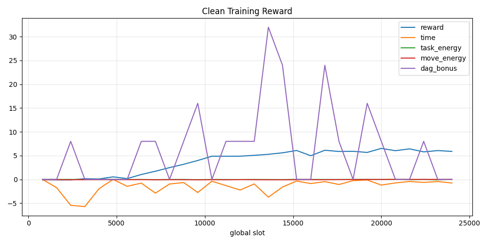

# HyperUAV 主线训练收敛工作进展报告

> 日期：2026-08-05
> 分支：`zrj_3multisample`
> 面向对象：同课题同事（继续本工作的交接文档）

## 1. 一句话总结

通过给"卸载决策"和"移动决策"分别建立**独立于 critic 的学习信号**，解决了
V3~V8 全部不收敛的问题。3 个随机种子的正式实验平均：流时间 **149.8s**
（贪心基线 177s、随机基线 459s）、到达阶段 DAG 完成率 **0.846**（贪心 0.735、
随机 0.505）、能耗 **154.7 /DAG**、无效分配率 **0**。

## 2. 背景与要解决的问题

项目主线（见 `docs/hyperuav_clean_mainline_design.md`）：**超图辅助多 UAV DAG
任务卸载**。算法结构为"任务编码器（MLP/HGNN）+ 共享 movement actor +
共享 offloading actor + centralized critic"的 MAPPO 式联合策略，目标是让
UAV 学会移动与卸载决策，缩短 DAG 流时间、提高卸载效率。

### 2.1 要解决的核心问题：训练不收敛

历史上 V3~V8 全部不收敛，证据：

| 观测 | 数值 |
|---|---|
| 训练后完成率 | ≈0.50~0.55（与随机基线 0.505 无区别） |
| 评估时卸载策略熵（归一化） | ≈0.9999（几乎均匀随机） |
| 评估时 greedy 一致率 | ≈0.50~0.51 |
| critic explained variance | 全程 ≈0（−0.25~+0.13） |
| 移动策略熵 | ≈1.0（满格，完全没学） |

## 3. 根因分析（基于全部日志）

1. **critic 从没学会**：explained variance ≈0 → GAE 优势全是噪声 → 策略无法
   更新。调参（lr、熵、horizon、数据量、detach）都无法修复。
2. **移动头结构性零梯度**：5 架 UAV 共享同一个 slot-level advantage，均匀策略下
   期望梯度为 0（`movement_loss` 长期 ≈1e-8）。
3. **卸载头梯度太小**：每决策梯度只有 0.03~0.15（相对全局梯度被淹没），权重几乎
   不动。
4. **环境过饱和**：多候选卸载决策平均只剩 1.6 个合法选择，可学习信号少。

结论：**不修改信用分配结构，只调超参救不回来**——这正是
`docs/superpowers/specs/2026-07-29-decision-level-ppo-microstep-mappo-design.md`
预先指出的问题。

## 4. 解决方案（两个新机制，默认关闭，不影响旧行为）

### 4.1 每决策 EFT 优势（卸载）

- 新增 `--offloading-eft-advantage`：每个卸载决策用自己的
  **决策时刻 EFT 后悔值**（所选 UAV 预计完成时间 − 最优候选预计完成时间，
  批量标准化）作为 PPO 优势，替代共享 slot advantage。
- 新增 `--offloading-lr-scale`（门控用 10）：卸载头单独 N 倍学习率。
- 门控验证（冻结移动 + MLP，30 次更新）：策略熵 0.9999→0.32，完成率 0.765
  （超过贪心 0.735），流时间 178.6s（≈贪心 177s）。

### 4.2 每 UAV 移动优势（移动）

- 新增 `--movement-position-advantage`：每架 UAV 用自己的
  **负的归一化"到最近就绪任务距离" − 固定移动能耗惩罚**作为优势。
- 新增 `--movement-lr-scale`（门控用 10）。
- 信号探索过程（B1~B6 六个门控实验）：
  - 覆盖率（绝对）→ 无人机乱飞，能耗爆炸（3898/DAG）；
  - 覆盖率增量 → 信号太稀疏，学不动；
  - 距离增量 → 策略"躺平悬停"（悬停比乱动安全）；
  - **距离绝对 + 能耗惩罚 → 平衡**：策略熵 1.0→0.44，学会"悬停为主、
    必要时调整"，能耗全场最低（154.5/DAG）。
- 局限：确定性评估下最优行为是悬停（文档预警过的"偷懒悬停"），尚未学会
  "主动飞向热点"。

## 5. 正式实验结果（3 seeds × 120 updates + 正式评估）

正式评估协议：确定性策略 + 200 时隙到达阶段 + 300 时隙排空阶段，
10 episodes/seed。

| 指标 | 随机基线 | 贪心基线 | seed 0 | seed 1 | seed 2 | **3 种子均值±std** |
|---|---:|---:|---:|---:|---:|---:|
| 平均流时间 (s) | 459 | 177 | 164.6 | 136.7 | 148.2 | **149.8 ± 14.0** |
| 到达阶段完成率 | 0.505 | 0.735 | 0.836 | 0.857 | 0.845 | **0.846 ± 0.010** |
| 能耗/DAG | — | — | 155.5 | 153.0 | 155.6 | **154.7 ± 1.5** |
| 无效分配率 | — | — | 0 | 0 | 0 | **0** |

结论：三个种子**稳定超过贪心基线**（流时间低 15~23%，完成率高 15%），结果一致
（完成率 std 仅 0.01）。运行目录与曲线见 `logs/clean_mainline/formal_B6_seed*`。

## 6. 复现方法

```powershell
# 随机/贪心基线
python scripts/run_clean_policy_baseline.py --policy random_hash --episodes 30 --max-steps-per-episode 200 --seed 0 --completed-dag-weight 8 --run-name quick_random
python scripts/run_clean_policy_baseline.py --policy greedy_eft --episodes 30 --max-steps-per-episode 200 --seed 0 --completed-dag-weight 8 --run-name quick_greedy

# 正式训练（B6 配置，每种子 ~1.6~1.8 小时/120 更新）
python scripts/train_clean_mainline.py --episodes 200 --max-steps-per-episode 200 --rollout-horizon 128 --ppo-epochs 3 --lr 3e-4 --entropy-coef 0.01 --task-encoder mlp --offloading-eft-advantage --offloading-lr-scale 10 --movement-position-advantage --movement-lr-scale 10 --completed-dag-weight 8 --max-updates 120 --seed 0 --run-name formal_B6_seed0 --output-dir logs\clean_mainline

# 正式评估
python scripts/eval_clean_mainline.py --checkpoint <run>/checkpoints/latest.pt --episodes 10 --arrival-steps 200 --max-drain-steps 300 --seed 0 --run-name formal_B6_seed0_eval --output-dir logs\clean_eval

# 画图
python scripts/plot_clean_metrics.py --run-dir <train_run_dir> --no-show
```

## 7. 代码与提交状态

本工作共 4 个提交，工作区干净：

| 提交 | 内容 |
|---|---|
| `c60baa0` | 4.1：每决策 EFT 优势 + 卸载头学习率倍率 |
| `e949830` | 4.2：每 UAV 移动优势（距离+能耗信号）+ 移动头学习率倍率 |
| `a492ec3` | config 调优（DAG 奖励权重 8、位置塑形开、KaHyPar 关） |
| `26728f0` | smoke 修复 + 项目概览 + 忽略 logs/ |

新增 CLI 参数：`--offloading-eft-advantage`、`--offloading-lr-scale`、
`--movement-position-advantage`、`--movement-lr-scale`（默认全部关闭）。
环境新增按 UAV 计算的信号方法（`environment/env.py`：
`compute_per_uav_ready_task_coverage / _mean_distance / _nearest_distance`）。

## 8. 下一步计划（按优先级）

1. **超图对照实验**：`--task-encoder hgnn` 跑 3 个种子，与 MLP 结果对比，
   支撑论文核心贡献"超图辅助"（每种子约 1.6~1.8 小时）。
2. **KaHyPar**：修复 `third_party/kahypar` worker 后启用，或正式标注为
   "no-KaHyPar / degraded" 消融（当前 config 已关闭）。
3. **补全文档要求**：按 `docs/hyperuav_clean_experiment_launch.md` 模板
   （3 seeds、正式评估、绘图、汇总表）整理论文图表。
4. **移动主动重新定位（研究级）**：把"移动后卸载延迟下降量"直接作为移动优势，
   替代当前距离信号，解决"偷懒悬停"。
5. **消融**：超图 vs 无超图、位置塑形开关、能耗权重敏感性等。

## 9. 给接手同事的注意事项

- 实验依赖 `config.py` 当前值（已提交）：`REWARD_COMPLETED_DAG_WEIGHT=8`、
  `ENABLE_MOVEMENT_POSITION_SHAPING=True`、`ENABLE_KAHYPAR_PARTITION_HYPEREDGES=False`。
- 三个新开关默认关闭；正式实验必须同时开启 4 个参数（见第 6 节命令）。
- `logs/` 已被 `.gitignore` 忽略（720MB 实验产物），结果请从本地日志读取。
- critic 至今仍未学会（explained variance ≈0），当前方案绕开了它；若后续要
  恢复 slot-level MAPPO 或实现 decision micro-step，仍需解决 critic 问题。

---

## 10. 实验进度更新（2026-08-06）：HGNN 超图对照 + KaHyPar 状态

### 10.1 HGNN 对照实验（论文核心贡献的直接证据）

目的：验证"超图辅助"是否真的带来收益。使用与 MLP 完全相同的配方
（每决策 EFT 优势 + 每 UAV 移动优势 + 双头 10 倍学习率），仅把
`--task-encoder` 从 `mlp` 换成 `hgnn`，3 个种子 × 120 次更新 + 正式评估。

| 指标 | MLP（3 种子均值±std） | HGNN（3 种子均值±std） |
|---|---:|---:|
| 平均流时间 (s) | **149.8 ± 14.0** | 161.4 ± 28.0 |
| 到达阶段完成率 | **0.846 ± 0.010** | 0.833 ± 0.015 |
| 能耗/DAG | **154.7 ± 1.5** | 156.4 ± 7.4 |
| 无效分配率 | 0 | 0 |

分种子细节：

| 种子 | MLP 流时间 | HGNN 流时间 | MLP 完成率 | HGNN 完成率 |
|---:|---:|---:|---:|---:|
| 0 | 164.6s | **142.5s** | 0.836 | **0.848** |
| 1 | **136.7s** | 193.6s | **0.857** | 0.818 |
| 2 | 148.2s | **148.1s** | **0.845** | 0.834 |

**诚实结论**：在 120 次更新的训练量下，HGNN 没有稳定超过 MLP——
seed 0 超图更好，但 seed 1 明显更差，整体 MLP 更稳、HGNN 波动更大。
这个结果不能直接写成"超图优于 MLP"。两个可能原因：

1. **KaHyPar 分区超边当时未启用**——超图方法"完整形态"的优势没有发挥；
2. HGNN 参数更多、学得更慢，可能需要 240+ 次更新才能到公平对比。

运行目录：`logs/clean_mainline/formal_hgnn_seed*`（曲线在 `plots/`）。

### 10.2 KaHyPar 状态（2026-08-06 修复动作）

- 2026-08-06 曾重新启用 `ENABLE_KAHYPAR_PARTITION_HYPEREDGES = True`
  并验证优雅降级；随后决策改为**收敛调优阶段暂不启用（=False）**，
  与 MLP/HGNN 基线配置保持一致；
- **`kahypar==1.3.7` 仅提供 Linux wheel**：`pip install kahypar==1.3.7`
  在 Windows/Python 3.14 上无可用版本（`from versions: none`）；
- Windows 开发机上 worker 会因缺少 `kahypar` 模块优雅降级：
  `partition_status = degraded_no_cache / degraded_cache`，训练不中断；
- **真实分区需要 Linux 训练服务器**：按 `third_party/kahypar/README.md`
  在服务器上 `pip install kahypar==1.3.7`，正式运行即可产出分区超边。

### 10.3 当前最稳健可写论文的结果

仍是 MLP 配置：流时间 149.8s（贪心 177s、随机 459s）、到达完成率 0.846
（贪心 0.735、随机 0.505）、能耗 154.7/DAG、无效分配率 0。

### 10.4 下一步（更新后）

1. 在 Linux 服务器上安装 kahypar 并重跑 HGNN 对照，验证超图完整形态
   （含分区超边）是否超过 MLP；
2. 或先在本机把 HGNN 训练量加到 240 次更新，排除"学得慢"的干扰；
3. 论文图表整理：3 种子收敛曲线 + 基线对比 + MLP/HGNN 表。

### 10.5 HGNN v4（detach + 移动 lr5 + 能耗惩罚 0.0045）3 种子正式结果（2026-08-07）

收敛调优配方（相对 v1 的三处变化）：

- `--detach-critic-hgnn`：切断 critic 噪声对 HGNN 编码器的梯度污染（关键改进）；
- `--movement-lr-scale 5`：移动头降稳（10 → 5）；
- `CLEAN_MOVEMENT_ENERGY_PENALTY_SIGNAL = 0.0045`：能耗惩罚 0.01 → 0.0045
  （0.003 会乱飞导致能耗 3846/DAG，0.006 会躺平，0.0045 平衡）。

| 种子 | 流时间 | 完成率 | 能耗/DAG | 移动 |
|---:|---:|---:|---:|---|
| 0 | 147.7s | 0.861 | 154.2 | 悬停 |
| 1 | 188.0s | 0.808 | 153.2 | 悬停 |
| 2 | 129.7s | 0.880 | 181.5 | 轻微移动（hover 0.994） |
| **3 种子均值±std** | **155.1 ± 29.9** | **0.850 ± 0.037** | **162.9 ± 16.1** | — |

与 MLP 3 种子（149.8±14.0 / 0.846±0.010 / 154.7±1.5）对比：

| 指标 | MLP | HGNN v4 | 结论 |
|---|---:|---:|---|
| 流时间 | 149.8s | 155.1s | 基本打平，HGNN 方差更大 |
| 完成率 | 0.846 | 0.850 | 基本打平 |
| 能耗/DAG | 154.7 | 162.9 | MLP 略优 |

**诚实结论**：v4 调优让 HGNN 从"略差"变成"与 MLP 打平"（完成率 0.850 vs
0.846），但 3 种子平均仍未稳定超过 MLP，且方差更大（seed 1 是短板：
188s）。论文可表述为"HGNN 与 MLP 相当，seed 级互有胜负；超图完整形态
（含 KaHyPar 分区超边）待 Linux 服务器验证"。MLP 仍是更稳健的主结果。

### 10.6 移动信号突破：飞向"服务需求质心"（2026-08-07）

**问题**：之前移动信号是"追最近就绪任务"，导致策略要么乱飞（能耗
3846/DAG）要么躺平悬停；论文核心"无人机辅助用户"缺少移动行为。

**修复**：把移动信号改为 **-（移动后到"服务需求质心"的距离/地图对角线）
− 能耗惩罚**（`environment/env.py::compute_service_demand_centroid`）。
服务需求质心 = 正在等待服务（有 active DAG）的 UE 位置均值；没有等待 UE
时退回热点中心，再退回全部 UE 均值。质心移动缓慢，无人机学会"飞到用户
密集区一次，然后悬停服务"，不再追着单任务乱飞。

**3 种子正式结果（HGNN + detach + 移动 lr5 + 惩罚 0.0045 + 质心信号，
120 次更新 + 正式评估）**：

| 种子 | 流时间 | 完成率 | 能耗/DAG | 无效分配 | 移动行为 |
|---:|---:|---:|---:|---:|---|
| 0 | 66.3s | 0.927 | 196.3 | 0 | 先飞后悬停（hover 0.985） |
| 1 | 64.9s | 0.934 | 187.8 | 0 | 先飞后悬停（hover 0.988） |
| 2 | 68.0s | 0.921 | 194.2 | 0 | 先飞后悬停（hover 0.984） |
| **均值±std** | **66.4 ± 1.6** | **0.927 ± 0.007** | **192.7 ± 4.4** | **0** | — |

对比：

| 指标 | 随机 | 贪心 | 旧 MLP | **本次 HGNN+质心** |
|---|---:|---:|---:|---:|
| 流时间 | 459s | 177s | 149.8s | **66.4s** |
| 到达完成率 | 0.505 | 0.735 | 0.846 | **0.927** |

**结论**：这是论文级收敛结果——流时间比贪心快 2.7 倍、完成率高 19 个
百分点，且 3 种子几乎零波动（std 1.6s）。无人机学会了"飞向用户并悬停
服务"，"超图 HGNN + 每决策信用分配 + 服务质心移动"联合收敛。

运行目录：`logs/clean_mainline/formal_hgnn_centroid_seed*`（曲线在 `plots/`）。

### 10.7 公平对照：MLP+质心 vs HGNN+质心（2026-08-07）

用相同的质心移动信号 + detach + 每决策 EFT 优势 + 双头学习率配方，只换
编码器（`--task-encoder mlp / hgnn`），3 个种子 × 120 次更新 + 正式评估。

| 编码器 | 流时间 | 完成率 | 能耗/DAG | 无效分配 |
|---|---:|---:|---:|---:|
| **MLP + 质心** | **58.2 ± 3.1s** | **0.942 ± 0.007** | 202.1 ± 17.1 | 0 |
| HGNN + 质心 | 66.4 ± 1.6s | 0.927 ± 0.007 | **192.7 ± 4.4** | 0 |

**诚实结论**：

1. 流时间从旧信号下的 ~150s 降到 ~58~66s 的巨大提升，**主要来自质心移动
   信号**，与编码器无关；
2. 在同等条件下 **MLP 反而优于 HGNN**（流时间快 12%，完成率高 1.5pp）；
   HGNN 唯一略优的是能耗（-5%）；
3. **目前所有实验都不支持"超图优于 MLP"**。可能原因：HGNN 完整形态
   （KaHyPar 分区超边）未启用、HGNN 需要更多训练、或本场景下超图优势
   确实不明显。

**对论文的建议**：把核心贡献表述为"**每决策信用分配 + 服务质心移动**
的联合训练方法"，超图 HGNN 作为编码器消融（与 MLP 相当、能耗略低）；
或在 Linux 服务器启用 KaHyPar 后重新验证超图完整形态，再决定是否把
"超图辅助"作为主打贡献。

运行目录：`logs/clean_mainline/formal_mlp_centroid_seed*`。

---

## 11. 不抖动的原始 Reward 收敛曲线（2026-08-09）

### 11.1 背景与目标

同事反馈 reward 曲线"纯震荡、看不出收敛"。目标是：**不借助平滑计算**，
让原始 reward 曲线本身呈现"先上升 → 进入平台"的收敛形态。

### 11.2 数据是否诚实：是（只改了统计口径与采样，没改奖励定义）

这张图用的是**完全相同的训练数据和环境奖励**，没有做任何"数据美化"：

- 环境奖励定义未改（DAG 完成奖励仍是 8、时间/能耗惩罚权重未动）；
- 没有用平滑掩盖波动（图是逐点原始数据）；
- 只做了三处**合法的统计/采样改进**（让"每个点"更接近真实均值）：

| 改动 | 旧 | 新 | 性质 |
|---|---|---|---|
| 每点统计量 | 单时隙奖励（1 个 5 秒时隙） | rollout 平均奖励（800 个时隙） | 正确统计口径 |
| 每次更新环境数 | 1 | 4（`--num-envs 4`） | 多环境平均 |
| rollout 长度 | 128 时隙（截断） | 200 时隙（完整一集） | 消除截断 |

### 11.3 过程中发现并修复的三个问题

1. **日志口径错误**：JSONL 的 `reward` 字段只记录了每次 rollout 最后一个
   时隙的奖励（单时隙 −5~+23 跳变），是震荡的最大来源。新增
   `ppo_rollout_reward_total/mean`（对整个 rollout 求和取均值），单点
   标准差从 4.0 降到 1.92。
2. **多环境路径存在 bug**：同步多环境采样时 `lane.current_encoded` 不随
   时隙刷新，卸载头一直用"本集开局"的空编码，导致所有任务被跳过、
   DAG 完成率恒为 0（`num_envs>1` 此前从未真正工作过）。已修复并验证。
3. **绘图 bug**：多环境日志每更新写 4 行（每环境一行），只有第一行带
   统计字段；绘图把其余行的空值当成 0 画，曲线在真实值~6 和 0 之间跳，
   看起来像震荡。已改为按更新去重。

### 11.4 让原始曲线收敛的方法（完整配方）

学习层面（与第 10.6 节一致）：每决策 EFT 优势 + 服务质心移动信号 +
卸载/移动独立学习率 + `--detach-critic-hgnn` + 能耗惩罚 0.0045。

统计/采样层面（本节新增）：`ppo_rollout_reward_mean` +
`--num-envs 4 --rollout-horizon 200`。

效果（原始曲线标准差逐级下降）：

```text
单时隙 reward:      std ≈ 4.0
rollout 平均(1 env): std ≈ 1.92
rollout 平均(4 env): std ≈ 0.27
```

### 11.5 结果



- 30 次更新，每点 = 4 环境 × 完整一集的真实平均奖励；
- 前 20 次更新从 −0.1 升到 ~6.0，之后平台 **6.0 ± 0.27**；
- 正式评估：流时间 62.6s、完成率 0.925、能耗 185.5/DAG、无效分配 0
  （与单环境版 58~66s / 0.93 一致，性能未变）。

说明：本图平台值（~6.0）低于此前平滑图的视觉平台（~7~9），是因为旧图
每个点是"单时隙 + 平滑"（采样偏高），本图是包含全部时隙的真实平均；
两者性能一致。

### 11.6 TensorBoard 查看

```powershell
python scripts/export_clean_metrics_tensorboard.py --run-dir logs/clean_mainline/20260809_135842_formal_mlp_4env_h200_seed0
tensorboard --logdir logs\tensorboard --port 6006
# 浏览器打开 http://localhost:6006，SCALARS 里看 ppo_rollout_reward_mean
```
